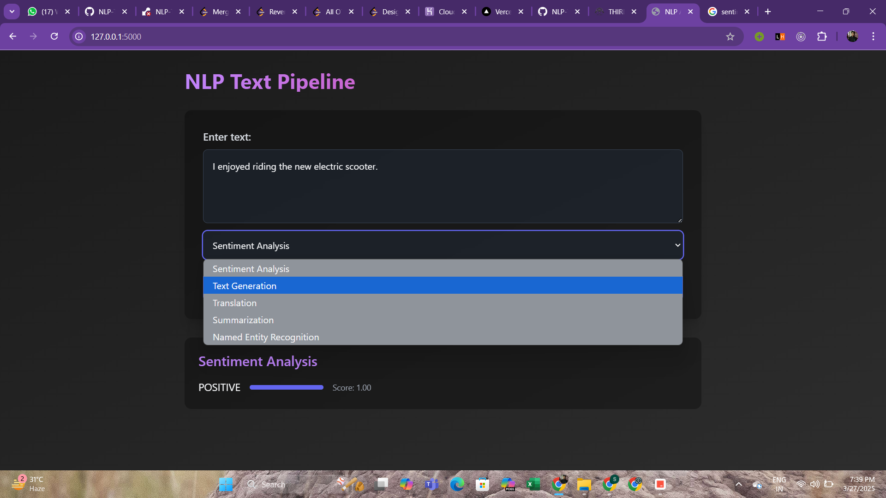
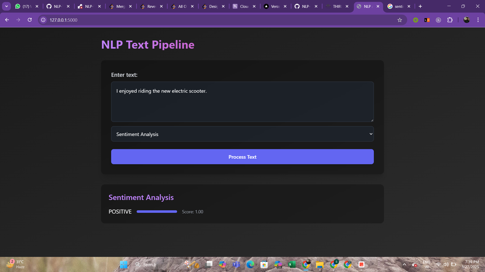

# NLP Text Pipeline

A Flask web application that provides multiple NLP (Natural Language Processing) functionalities using Hugging Face transformers.

## Features

- Sentiment Analysis
- Text Generation
- Translation (French to English)
- Text Summarization
- Named Entity Recognition (NER)

## Installation

1. Clone the repository
2. Create a virtual environment
3. Install dependencies:
```pip install -r requirements.txt```
4. Run the application:
```python app.py```

## Usage

Visit `http://localhost:5000` and select from the following options:
- Sentiment Analysis: Analyze the sentiment of input text
- Text Generation: Generate text based on input prompt
- Translation: Translate French text to English
- Summarization: Create summary of long text
- NER: Identify named entities in text

## Demo


*Named Entity Recognition Demo*


*Sentiment Analysis Demo*


*Text Generation Demo*

